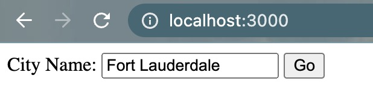
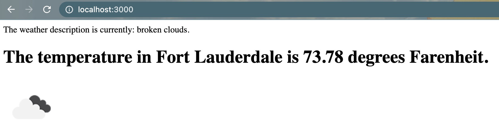

# Weather Project App

This is a weather app which gathers corresponding weather information using an API from: https://openweathermap.org/

This is a weather app project using Node.js and Express.js with Heroku server. This uses an API to gather relevant weather information for a city that the user inputs. This returns the weather description, temperature, and a corresponding image of the current weather at that specific time for that specific location. The main focus of this project is back-end development.

---

### .env

Note the .env_sample file example of using open weather API_KEY. This uses dotenv to store the personal API as process in code. More info can be found here about dotenv: https://www.npmjs.com/package/dotenv

You will need to create a new .env file for your personal API_KEY. This is where you will store the variable which will be used in the app code.
